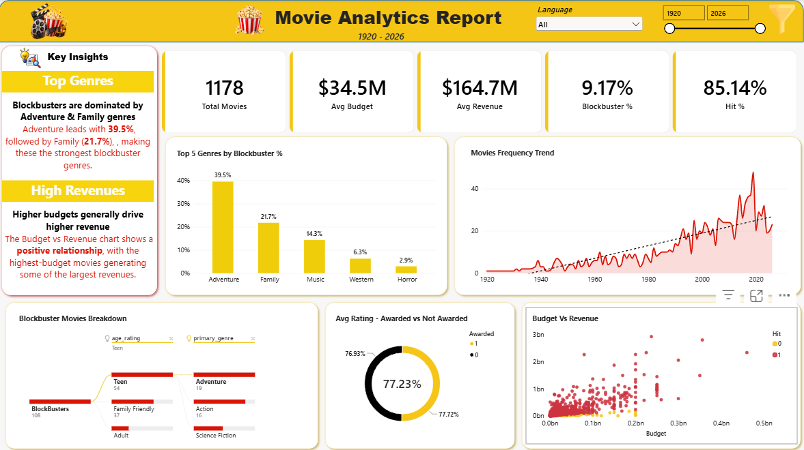

# 🎬 Movies Analytics Project



## 📌 Project Overview

An end-to-end **Data Science project** that transforms publicly available movie data from **TMDB** into actionable insights through:

- Web Scraping
- Data Cleaning & Feature Engineering
- Exploratory Data Analysis (EDA)
- Machine Learning
- Interactive Power BI Dashboard

---

## 🎯 Project Objective

The objective was to collect real-world movie data from the web, clean and analyze it, identify meaningful trends, build a classification model to predict movie success, and communicate the findings through an interactive dashboard.

---

## 🔄 Project Workflow

```text
TMDB Web Data
     ↓
Web Scraping
     ↓
Data Cleaning & Preprocessing
     ↓
Feature Engineering
     ↓
Exploratory Data Analysis
     ↓
Machine Learning
     ↓
Power BI Dashboard
     ↓
Business Insights & Recommendations
```

## 🌐 1. Web Scraping

### Data Source

**The Movie Database (TMDB)**

### Tools Used

- Python
- Requests
- BeautifulSoup
- Pandas

### Scraping Approach

A two-layer scraping process was used:

1. Scraped movie listing pages to collect movie URLs.
2. Visited individual movie pages to extract detailed information.

### Data Collected

- Movie Title
- Release Year
- Certification
- Genres
- Runtime
- Director
- Awards
- Original Language
- Budget
- Revenue
- Rating

### Output

**2,000 movie records** were collected and saved as CSV.

---

## 🧹 2. Data Cleaning & Preprocessing

Major preprocessing steps included:

- Handling missing values
- Checking duplicate records
- Standardizing certification categories
- Cleaning genre values
- Converting runtime into minutes
- Converting budget and revenue into numeric values
- Handling invalid budget values
- Converting awards into a binary feature
- Extracting primary genre
- Creating genre count

### Engineered Features

```python
profit = revenue - budget

ROI = (revenue - budget) / budget * 100

genre_count = number of genres

primary_genre = first/main genre
```
### Engineered Features

```
```

```
profit = revenue - budget

ROI = (revenue - budget) / budget × 100

genre_count = number of genres

primary_genre = first/main genre
```

### Financially Complete Data

After preprocessing:

- 1,276 movies had budget data
- 1,450 movies had revenue data
- 1,178 movies had both budget and revenue

---

## 📊 3. Exploratory Data Analysis

EDA was performed to identify:

- Movie trends over time
- Genre distribution
- Rating patterns
- Budget and revenue relationships
- Profitability
- Outliers
- Correlations

### Key Findings

- Drama was the most represented primary genre.
- Movie frequency increased considerably in recent years.
- Average rating was approximately **77.23**.
- Budget and revenue showed a strong positive relationship.
- Rating had only a weak relationship with revenue.
- Financial variables contained significant outliers.
- Adventure showed the strongest blockbuster representation in the dashboard analysis.

---

## 🎯 Success Features

### IsHit

`IsHit` was created using the project's profit-based definition.

```
```

```
IsHit = 1 → Hit
IsHit = 0 → Not Hit
```

### Blockbuster

A movie was classified as a **Blockbuster** when:

```
```

```
Revenue > $500 Million
```

The dashboard showed approximately:

- **Hit Rate:** 85.14%
- **Blockbuster Rate:** 9.17%

---

## 🤖 4. Machine Learning

### Problem Type

**Binary Classification**

### Target

```
```

```
IsHit
```

### Models Tested

- Logistic Regression
- Decision Tree
- Random Forest

### Data Leakage Prevention

Because `IsHit` is based on profit, the following variables were excluded from the model:

```
```

```
profit
profit_in_mil
revenue
revenue_in_mil
roi
IsHit
```

### Modeling Process

```
```

```
Train-Test Split
       ↓
Categorical Encoding
       ↓
Feature Scaling
       ↓
SMOTE
       ↓
Model Training
       ↓
Model Evaluation
```

### Model Performance

| ModelAccuracyHit PrecisionHit RecallHit F1 |           |       |           |           |
| ------------------------------------------ | --------- | ----- | --------- | --------- |
| Logistic Regression                        | 69.1%     | 88.1% | 73.6%     | 80.2%     |
| Decision Tree                              | 73.3%     | 88.3% | 79.1%     | 83.5%     |
| Random Forest                              | **76.3%** | 86.4% | **85.6%** | **86.0%** |

### Best Overall Model

**Random Forest**
It achieved the highest overall accuracy and Hit-class F1 score among the tested models.

---

## 📈 5. Power BI Dashboard

### Dashboard: Movies Analytics Report

The interactive dashboard includes:

### KPIs

- Total Movies
- Average Budget
- Average Revenue
- Blockbuster %
- Hit %

### Visualizations

- Top Genres by Blockbuster %
- Movies Frequency Trend
- Blockbuster Movies Breakdown
- Awarded vs Not Awarded Rating
- Budget vs Revenue Scatter Plot
- Interactive filters and slicers

### Dashboard Features

- Year slicer
- Language slicer
- Interactive filtering
- Trend analysis
- Hierarchical analysis
- Drill-through
- Bookmarks
- Sync slicers
- AI / analytical visuals
- Custom visuals

---

## 💡 Key Business Insights

1. **Blockbusters are relatively rare**, representing around 9% of the financially complete dashboard dataset.
2. **Adventure leads the blockbuster analysis**, followed by Family.
3. **Higher budgets generally correspond to higher revenues**.
4. **Rating alone does not strongly explain revenue**, indicating that commercial success depends on multiple factors.
5. **Movie profitability is highly uneven**, with a small number of movies generating exceptionally high profits.
6. The ML models identify **Hits more effectively than Flops**, making predictions useful as decision-support rather than guaranteed outcomes.

---

## 🚀 Recommendations

- Evaluate production budgets alongside genre and market potential.
- Analyze genre-level blockbuster rates rather than relying only on genre popularity.
- Avoid using movie rating as the sole indicator of commercial success.
- Keep **Hit** and **Blockbuster** as separate measures of success.
- Use ML predictions as a supporting business signal.
- Improve future analysis by increasing the number of movies with complete financial information.
- For future pre-release prediction, prioritize features that are available before movie performance is known.

---

## 🛠️ Tech Stack

| AreaTools        |                                 |
| ---------------- | ------------------------------- |
| Web Scraping     | Python, Requests, BeautifulSoup |
| Data Processing  | Pandas, NumPy                   |
| Visualization    | Matplotlib, Seaborn             |
| Machine Learning | Scikit-learn, Imbalanced-learn  |
| Dashboard        | Microsoft Power BI              |
| Data Storage     | CSV                             |
| Documentation    | Google Colab Notebook, GitHub        |

---

## 📂 Project Structure

```
```

```
Movies-Analytics/
│
├── notebooks/
│   ├── Capstone1.ipynb
│   ├── Capstone2.ipynb
│   ├── Capstone3.ipynb
│   └── Capstone4.ipynb
│
├── data/
│   ├── movies_data.csv
│   ├── movies_data_cleaned.csv
│   └── movies_data_eda.csv
│
├── dashboard/
│   └── Movies_Analytics_Report.pbix
│
├── report/
│   └── Movies_Analytics_Final_Report.docx
│
└── README.md
```

---

## 🏁 Conclusion

This project demonstrates a complete real-world data science workflow:
**Web Data → Structured Dataset → EDA → Machine Learning → Business Intelligence**
The final solution combines statistical analysis, predictive modeling, and interactive visualization to understand movie trends, financial performance, blockbuster behavior, and movie success.
